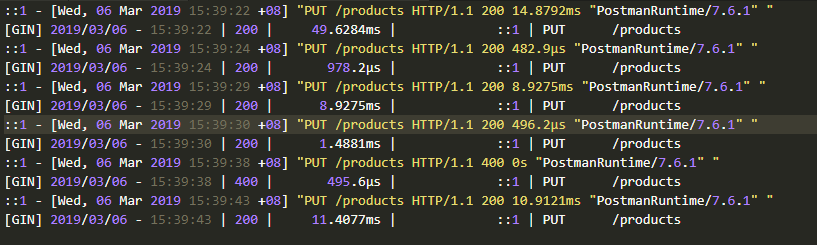

# Go CRUD API

## Description
Simple Go example for me to get better acquainted with Go, particularly the Gin framework and the Gorm object relational-mapper.

The `init()` function creates a `sqlite3` database with randomly generated prices for 1000 products. Each product has a code `L+<number>` (e.g. `L145`), and is unique.

## How to install
`go run main.go` to run it and navigate to `localhost:4531`.

*Optional*:
`go get github.com/codegangsta/gin` to get live gin-reloading. Run it using `gin -a 4531 main.go`. Any changes will be automatically detected for much faster development. Note that you will navigate to `localhost:3000` instead as the default proxy for the gin reloader listens on that port.

## Routes
* `/products/` : [GET] shows all products and prices
* `/products`:  [POST] add one product and price
* `/products` : [PUT] update one product and price
* `/products/<code>`: [GET] shows price for given product code

## Logs

Logs get saved to `gin.log` in the project directory root.

